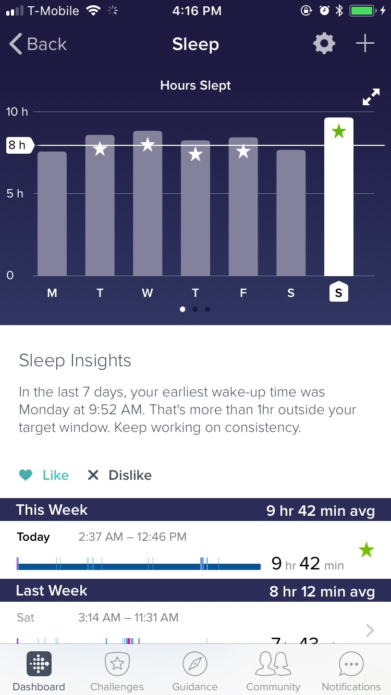
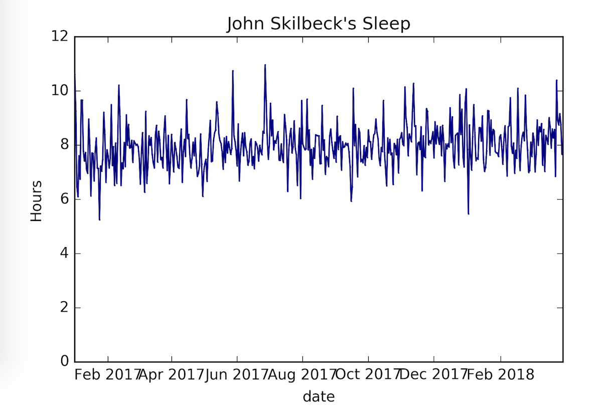
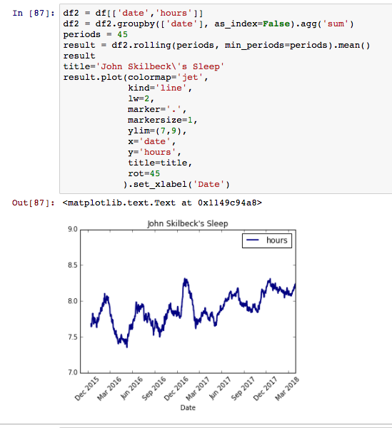
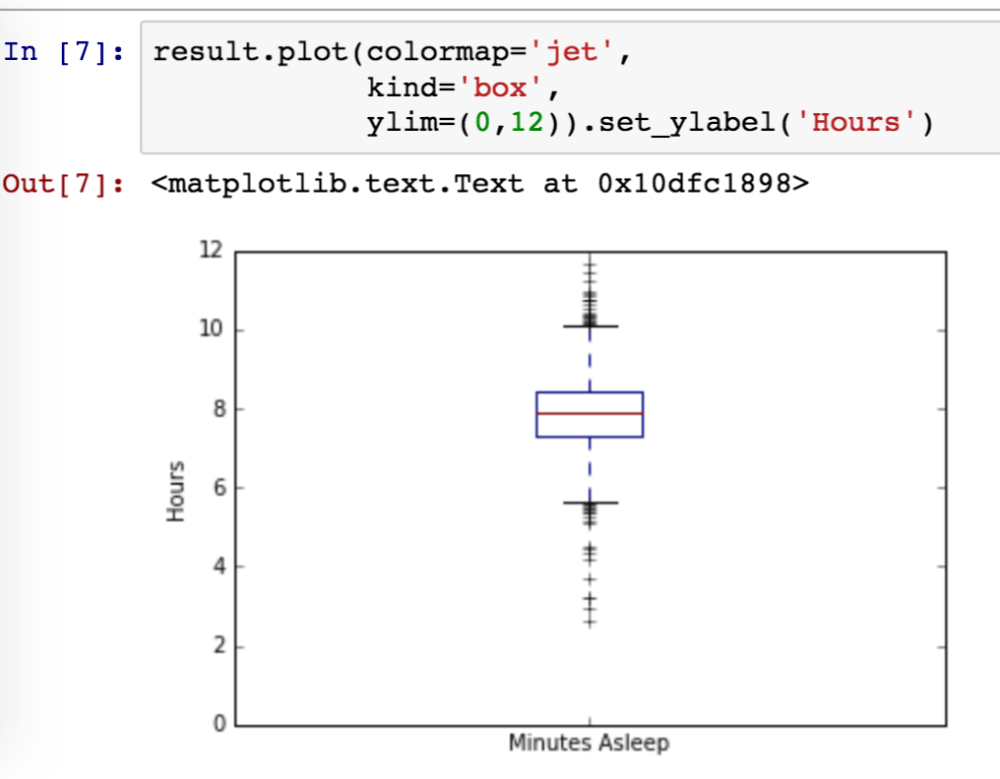
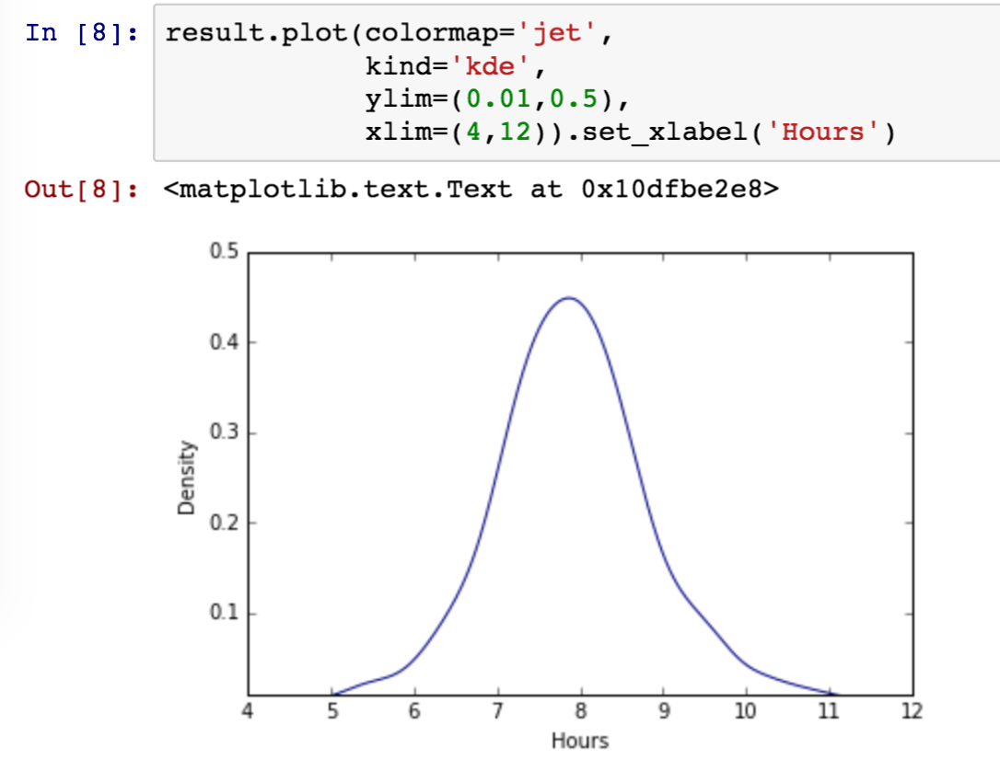

## f i t b i t

Analysis of fitbit data

### Why

I sleep too damn much



Why not do an analysis on that?








### environment
Download sleep data from <https://www.fitbit.com/export/user/data> , place them
in `data/sleep/[year]/[year]-[month].csv`

Then get the ipython/jupyter notebook up and running
```bash
rmvirtualenv data
mkvirtualenv --python=$(which python3) data && workon data
pip install -r requirements.txt
ipython notebook
```
